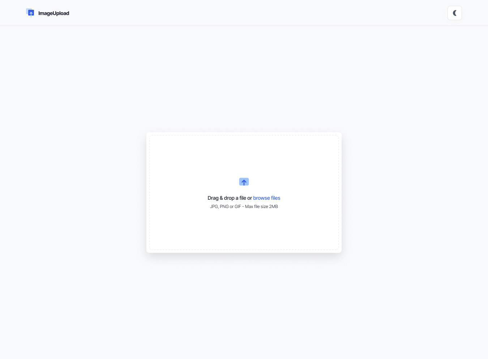

# 🌄 Imageer

**Imageer** is a modern, responsive full-stack web application that allows users to upload images, convert them into multiple formats, share them via social media or shareable links, and download them with ease. The platform supports both light and dark modes and ensures user-uploaded images are stored securely for 30 days before being automatically deleted by a background server process.

🔗 **Live Demo**: [https://imageer.netlify.app/](https://imageer.netlify.app/)  
📦 **GitHub Repo**: [https://github.com/arbaz93/Imageer.git](https://github.com/arbaz93/Imageer.git)



---

## 🚀 Features

- 📤 Upload images to cloud storage
- 🔄 Convert images into multiple formats:
   -png, jpeg, jpg, jpe, gif, webp, tiff, tif, avif, dz, raw
- 📂 Convert multiple images at the same time (batch conversion)
- 🌐 Server-side image conversion (works from any device — no local processing required)
- 🔗 Generate and copy shareable links
- 📣 Share directly to social media
- 💾 Download uploaded or converted images
- ⏳ Images automatically deleted after 30 days (managed via queue and cron jobs)
- 🌙 Light and Dark Mode support
- 🖥️ Fully responsive and modern UI (based on DevChallenges.io)
- 🧹 Clean, maintainable code following industry standards

---

## 🛠️ Tech Stack

### 🔧 Frontend

- **React 19**
- **React Router DOM**
- **Tailwind CSS**
- **Zustand** – Lightweight state management
- **Axios** – API communication
- **Firebase (Client SDK)** – Cloud storage and user interaction

### ⚙️ Backend

- **Express.js (v5)**
- **Cloudinary** – Image hosting and transformation
- **Firebase Admin SDK** – Server-side storage management
- **dotenv** – Environment variable management
- **CORS** – Cross-Origin Resource Sharing
- **Node.js Cron Jobs** – Periodic deletion of expired images

### 🧰 Development Tools

- **Vite** – Fast build and development server
- **ESLint** – Linting for code quality
- **SVGR** – SVG to React component integration
- **Netlify** – Deployment for frontend


## 📁 Project Structure

```
.
├── design/                 # UI mockups and previews
├── public/                 # Static assets
├── resources/              # Shared resources
├── src/                    # Main application source
│
│   ├── assets/             # Icons and image assets
│   ├── components/         # Reusable React components
│   ├── fonts/              # Custom fonts
│   ├── js/                 # Utility JS modules (Cloudinary, API, Social Share)
│   ├── pages/              # Route-level components
│   ├── utils/              # Constants and helper functions
│   └── zustand/            # Zustand store
│
├── index.html              # HTML entry point
├── main.jsx                # App entry point
├── index.css               # Global styles
├── vite.config.js          # Vite configuration
├── tailwind.config.js      # Tailwind CSS config
├── eslint.config.js        # ESLint configuration
├── package.json            # Frontend dependencies
└── thumbnail.jpg           # App thumbnail

```
---

## 📝 Environment Variables

Ensure that the following environment variables are set in your `.env` file for proper configuration:

```
# 🌩️ Cloudinary Configuration
VITE_CLOUD_NAME=<cloudinary-cloud-name>
VITE_BASE_URL='https://api.cloudinary.com/v1_1'
VITE_UNSIGNED_PRESET_NAME=<cloudinary-unsigned-preset-name>

# 🔗 Backend Server
VITE_SERVER_URL='http://localhost:3000'


```


---
## 🕹️ Setting up frontend Locally

To run the imageer frontend locally:

1. Clone the repository:

   ```bash
   git clone https://github.com/arbaz93/Imageer.git
2. Install dependencies:
    ```bash
    npm install
3. Set up your environment variables in a .env file (based on the example above).
4. Setup cloudinary account | note: see https://cloudinary.com/documentation for more information.

5. Setup backend server by following the instructions at https://github.com/arbaz93/Imageer-backend

6. Start development server
    ```bash
    npm run dev
    ```

### Frontend

| Command           | Description              |
|-------------------|--------------------------|
| `npm run dev`     | Start development server |
| `npm run build`   | Build for production     |
| `npm run lint`    | Lint codebase            |
| `npm run preview` | Preview production build |


## 🎯 Future Roadmap

Planned enhancements:

- ✂️ Cropping and resizing tools
- 🌟 Image enhancements (brightness, contrast, filters)
- 🔧 Advanced image editing features

---

## 🧑‍💻 Contributing

Contributions are welcome! To contribute:

1. Fork the repository
2. Create a new branch (`git checkout -b feature-name`)
3. Commit your changes (`git commit -m 'Add new feature'`)
4. Push to the branch (`git push origin feature-name`)
5. Open a Pull Request

---

## 📄 License

This project is licensed under the [MIT License](LICENSE).

---

Let me know if you'd like to include setup instructions for local development or deployment!

---

**Author**: Yousaf Arbaz  
**Backend Repo**: `https://github.com/arbaz93/Imageer-backend`
